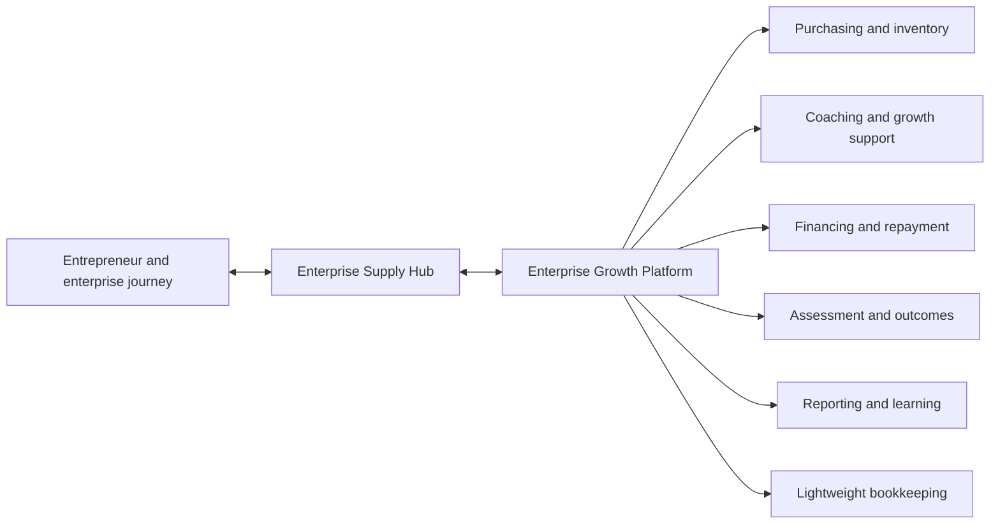
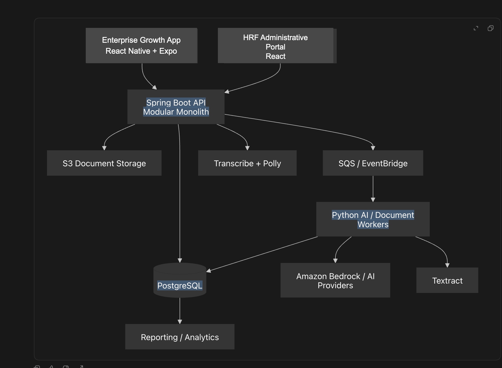

# Reinvest-to-Grow™ Technology Planning

This repository is the central planning, architecture, and cross-repository specification workspace for technology supporting Home Roots Foundation's **Reinvest-to-Grow™**.

The program is intended to help women entrepreneurs in Haiti and other resource-constrained settings retain more business income, reinvest it productively, strengthen their enterprises, and improve economic resilience. Technology is not the intervention. Its role is to help the nonprofit deliver the methodology consistently, measure it responsibly, learn from evidence, and scale what works.

> **Current status:** Planning and feasibility research. No production application, cloud environment, or participant-data system has been implemented from this repository.

See [Product Terminology](docs/product-terminology.md) for the approved names and definitions used across planning, specifications, and component repositories.

## Nonprofit Vision

Reinvest-to-Grow™ will support women entrepreneurs through a practical enterprise-development approach. It combines margin improvement, appropriate growth capital, coaching, training, productive reinvestment, and evidence-based learning. The Enterprise Supply Hub is expected to be an important operating environment for collective purchasing, inventory access, entrepreneur support, and program learning.

The long-term digital goal is an **Enterprise Growth Platform** that helps the nonprofit:

- enroll entrepreneurs and maintain enterprise profiles;
- support Supply Hub purchasing, suppliers, inventory, and demand aggregation;
- provide coaching, training, and action plans;
- administer appropriate financing and repayment;
- track productive reinvestment and enterprise progress;
- collect traceable outcome observations; and
- improve delivery through reporting, evaluation, and organizational learning.

## Program Model

Reinvest-to-Grow™ is based on a proposed enterprise-development pathway:

```text
Retain more income
  -> Reinvest productively
  -> Build productive capital and enterprise capability
  -> Strengthen enterprise performance
  -> Improve economic resilience
```

Its initial operating and validation environment is the **Enterprise Supply Hub**, where collective purchasing may lower inventory costs and improve business margins. Financing, coaching, measurement, and bookkeeping support that journey; none should be treated as the entire methodology.

The methodology is explicitly evidence-seeking. Its causal model, Enterprise Growth Score, and projected outcomes are working propositions to test, not established impact claims. The technology must preserve that distinction by keeping measurements traceable to dated source observations and by supporting continued learning.

## Product Direction

The long-term direction is an offline-capable enterprise growth operating system organized around the entrepreneur and enterprise journey, rather than around loans or accounting transactions alone.



## Overarching Technical Direction

The current directional technology stack is:

| Area | Direction |
| --- | --- |
| Mobile | React Native, Expo, and TypeScript |
| Offline data | SQLite local projection with a durable synchronization queue |
| HRF Administrative Portal | React, Vite, TypeScript, and Material UI |
| Backend | Java and Spring Boot modular monolith, initially packaged as one service |
| Data | PostgreSQL, with S3 for documents |
| Cloud | AWS, provisioned with Terraform |
| Integration | Versioned APIs, idempotent writes, and replaceable provider boundaries |
| AI and document processing | Constrained workers for speech, OCR, translation, and structured proposals |
| Delivery | GitHub Actions and specification-driven, cross-repository changes |



This architecture can support the full nonprofit vision as a foundation, but not without additional product domains and integrations. Its offline mobile client, role-based staff tools, modular backend, PostgreSQL data model, asynchronous workers, audit history, and security controls fit the operating model. The first version must be organized around the entrepreneur and enterprise rather than bookkeeping and loans.

To support the complete vision, the platform would need first-class capabilities for enrollment and consent, Supply Hub catalog and inventory, suppliers and purchasing, coaching and training, assessments, productive reinvestment, financing, outcome observations, reporting, and research exports. It would also need integrations for identity and notifications, payment or mobile-money rails, accounting or loan servicing where appropriate, document processing, speech and translation, and possibly external analytics or reporting tools. These should be added as validated operating needs emerge.

The architecture image reflects the original directional design. The MVP prototype will use one Dockerized Spring Boot microservice deployed to AWS EKS; it will retain modular internal boundaries so the system can evolve without prematurely operating multiple services.

## Engineering Principles

- **Methodology before software.** Product behavior should follow validated operating workflows, not force the program into a tool's assumptions.
- **Offline first.** Core field workflows must remain usable under unreliable connectivity.
- **Offline first.** Core field workflows must remain usable under unreliable connectivity.
- **Human-centered interaction.** Use plain language, touch-first fallbacks, multilingual design, and confirmation flows appropriate to users' context.
- **AI proposes; people decide.** Speech, OCR, translation, and AI may create structured suggestions, but cannot finalize financial records, approve financing, or manufacture impact claims.
- **Traceability by design.** Important financial and outcome records require source data, validation, audit history, and reproducible reporting.
- **Security from the start.** Role-based access, nonprofit-owned accounts, encryption, tenant isolation, privacy controls, and recovery planning are baseline concerns.
- **Build the differentiation.** Focus custom development on the entrepreneur journey, Supply Hub workflows, reinvestment, measurement, and learning loops; use established services for commodity capabilities when they fit.
- **Evidence before scale.** Use small prototypes and field feedback to resolve product risk before committing to a broad platform build.

## Build, Buy, or Integrate

No single mature product is expected to cover the complete combination of accessible mobile bookkeeping, voice and multilingual interaction, offline use, Supply Hub workflows, coaching, financing, and traceable impact reporting.

The working strategy is hybrid:

1. Evaluate existing products and services where they reduce cost, risk, and time to learning.
2. Keep identity, integration, audit, reporting, and data portability under clear architectural control.
3. Build custom experiences where field evidence shows that the nonprofit's workflows are not served well by existing tools.

Likely integration candidates include speech-to-text, text-to-speech, translation, OCR, authentication, file storage, notifications, payment rails, and general reporting infrastructure. Vendor choices remain subject to feasibility, cost, privacy, and nonprofit ownership requirements.

## MVP Approach

The MVP should test a narrow, useful workflow in the nonprofit's operating context. A prototype has been selected to test technical feasibility and enable rapid development. It will be a working product and a thin slice of the MVP, not a throwaway demo or a commitment to the complete platform scope.

Both the MVP and prototype will include offline operation and speech-powered interaction. These are central technical and user risks, so they must be demonstrated early. Touch input remains the reliable fallback, and the first speech experience should support English and French; Haitian Creole support can follow once language quality and operating requirements are confirmed.

## MVP Prototype Product Features

The recommended prototype is a scaled-down lightweight bookkeeping tool for one entrepreneur or small pilot group. It should be useful without attempting to become a full accounting or loan-management system.

Requirements:

- Create a simple enterprise profile with currency and language settings.
- Record sales and expenses through touch input or confirmed speech proposals.
- Work fully offline, save entries locally, and show local, syncing, synced, or failed status.
- Review, edit, and confirm each proposed entry before it becomes a durable record.
- Show recent activity and a simple weekly income, expense, and estimated balance summary.
- Support English and French in the initial interface and speech workflow, with Haitian Creole evaluated as a next language.
- Use synthetic data only and retain the original input, confirmed result, and audit event.

Receipt capture, loans, inventory, coaching, and funder reporting should remain outside this first prototype unless field testing shows that one is essential to the selected pilot workflow.

## MVP Prototype Technical Design

### Application and Data Flow

- **Mobile:** React Native with Expo and TypeScript; touch-first screens with speech capture and confirmation.
- **Local persistence:** SQLite stores the recent transaction projection, language/settings, and durable sync queue so entries survive restarts and connectivity loss.
- **Backend:** One Dockerized Spring Boot microservice, internally structured as a modular monolith, exposed through versioned HTTPS APIs and deployed on AWS EKS.
- **Database:** PostgreSQL stores enterprises, transactions, sync identities, audit events, and language/configuration metadata.
- **Synchronization:** Idempotency keys allow safe retries; the MVP supports append-only transaction creation and clear failure/retry states.

### Mobile Screens and Flow

1. **Setup:** Choose language, currency, and enterprise profile.
2. **Home:** See recent activity, estimated weekly summary, and sync status.
3. **Record:** Choose sale or expense, enter by touch or speech, review the structured proposal, and confirm.
4. **Transaction detail:** Edit or correct an entry and see its local or synced state.

The core flow is: record offline -> review and confirm -> save locally -> sync when connected -> display the server-confirmed status.

### MVP Infrastructure and AWS Services

- Docker image built and tested by GitHub Actions.
- AWS EKS cluster with one Spring Boot workload, Kubernetes configuration, and separate development resources.
- Amazon RDS for PostgreSQL, Secrets Manager for credentials, and CloudWatch for logs and metrics.
- Amazon Cognito for initial authentication if user accounts are included in the pilot.
- Amazon S3 for optional receipt files, with presigned access and encryption.
- Amazon Transcribe and Polly behind an internal speech provider interface; the prototype may use a controlled adapter while language quality is evaluated.
- Terraform for repeatable AWS infrastructure, including the MVP network, EKS runtime, PostgreSQL database, TLS configuration, backup settings, secrets access, and least-privilege IAM roles.

### MVP Security

- Use synthetic data only; no participant or production financial data belongs in the prototype.
- Require HTTPS/TLS for mobile-to-backend traffic and encrypted storage for PostgreSQL, S3 files, backups, and secrets.
- Store credentials in AWS Secrets Manager; use short-lived IAM roles for workloads and deployment automation instead of committed access keys.
- Grant the Spring Boot service and GitHub Actions only the AWS permissions they need, with separate development and production access boundaries.
- Keep every financial change tied to the authenticated enterprise, user, original input, confirmed result, and audit event.
- Restrict PostgreSQL and S3 access to private network paths and application roles; use presigned URLs for optional receipt files.
- Enable RDS automated backups and define a basic restore check before using real data.
- Send operational logs and security-relevant events to CloudWatch without recording secrets or sensitive speech content.

The MVP should defer multi-service deployment, complex conflict resolution, automated loan servicing, broad AI automation, and production participant data until the prototype demonstrates that the core workflow is useful and technically reliable.

## Intended Audience

This repository is public to make the project's reasoning inspectable.

For potential grant funders and partners, it demonstrates that the program is developing a pragmatic technical path grounded in mission, operational reality, data stewardship, cost awareness, and measurable learning.

For engineers and organizations evaluating the technical work, it demonstrates the architecture process behind an evolving real-world system: discovering the actual domain, separating product and technical risk, evaluating build versus buy, and establishing safety boundaries for AI and financial data.

## Responsible Development

Prototype work must use synthetic data only. Credentials, payment details, recovery codes, participant records, and other sensitive information do not belong in Git. Nonprofit accounts and production data must remain under nonprofit ownership with role-based delegated access and explicit approval for paid services or external deployment.
