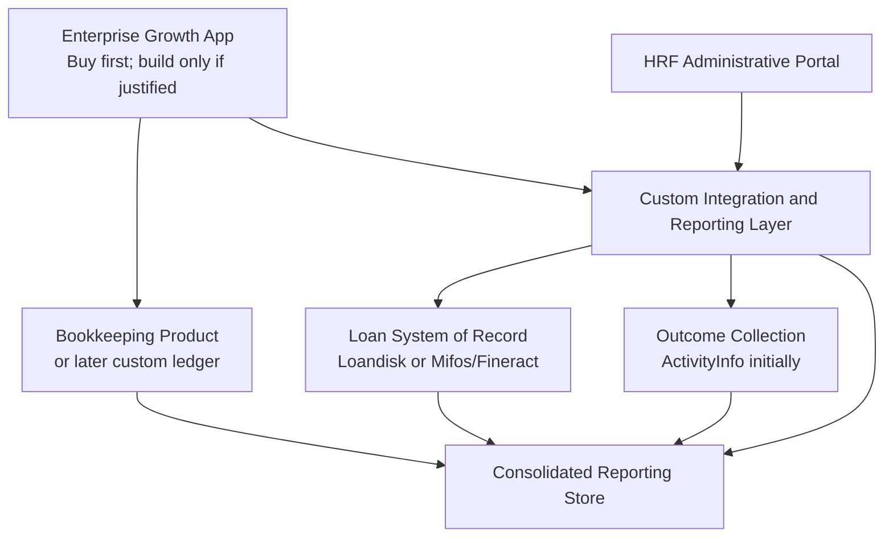

# Build-vs-Buy Analysis

## Status and Purpose

- **Research date:** June 2026
- **Decision scope:** Mobile enterprise tracking, voice and document entry, financing administration, and nonprofit outcome reporting
- **Architecture baseline:** AWS-native custom platform described in `ARCHITECTURE.md`
- **Purpose:** Determine whether the nonprofit should build, buy, customize, or integrate existing products

## Executive Summary

No single mature SaaS product identified during this research meets the complete requirement:

- Extremely simple bookkeeping for business owners
- Voice-operated and multilingual interaction
- Receipt and document scanning
- Offline use in low-connectivity environments
- Nonprofit financing administration
- Entrepreneur and enterprise performance reporting
- Grant and impact reporting
- A unified HRF Administrative Portal view

However, substantial portions of the system are already available as SaaS or open-source products. Building the entire platform from scratch would duplicate difficult, regulated, and error-prone loan-servicing and accounting capabilities.

### Recommended Direction

Use a **hybrid buy-and-build strategy**:

1. **Buy or adopt an existing loan-management core** for loan schedules, balances, repayments, portfolio-at-risk reporting, and lender accounting.
2. **Pilot existing bookkeeping products** with entrepreneurs before building custom bookkeeping.
3. **Build only the differentiated Enterprise Growth App experience and integration layer** if existing bookkeeping products fail the field pilot.
4. **Use a configurable reporting/data-collection product initially** for grant and outcome reporting rather than building a complete impact-management suite.

The first products to evaluate are:

- **Loandisk** as the fastest SaaS loan-management pilot
- **Mifos X / Apache Fineract** if ownership, extensibility, or long-term scale matters more than implementation simplicity
- **Talkbooks** as the closest voice-first bookkeeping product
- **SparkReceipt, Zoho Books, and Finovo** as bookkeeping and document-capture alternatives
- **ActivityInfo** for offline-capable outcome collection and program reporting
- **Salesforce Nonprofit Cloud** only if the nonprofit also needs a broad organizational CRM and can support the implementation burden

The nonprofit should not begin by building a custom loan-management system. It should run structured product trials before deciding whether custom entrepreneur bookkeeping is justified.

## 1. Decision Criteria

### 1.1 Entrepreneur Experience

- Simple enough for users without bookkeeping training
- Mobile-first
- Voice input and spoken output
- Multilingual interface and speech
- Receipt and document scanning
- Works with unreliable connectivity
- Supports cash-heavy businesses
- Supports local currencies and business practices
- Gives useful, understandable reports

### 1.2 Nonprofit Operations

- Loan origination and servicing
- Repayment schedules and collections
- Delinquency and portfolio-at-risk reporting
- Configurable loan products
- Borrower documents and notes
- Roles, permissions, and audit history
- Outcome and grant reporting
- Portfolio sustainability metrics

### 1.3 Technology and Governance

- APIs and reliable data export
- Data ownership and portability
- Security and privacy controls
- Tenant isolation
- Regional availability and data residency
- Vendor stability
- Configuration and integration effort
- Total cost of ownership
- Ability to operate with volunteers

## 2. Product-Market Finding

The requirements span four distinct software categories.

| Category | What Existing Products Do Well | Common Gap |
|---|---|---|
| Small-business accounting | Transactions, receipts, invoices, financial statements | Usually too complex, online-dependent, and not connected to the nonprofit's loan program |
| Voice-first bookkeeping | Simple conversational entry and reports | Young vendors, limited enterprise controls, limited offline support, uncertain APIs |
| Microfinance/core lending | Loan products, schedules, repayments, portfolio reporting, accounting | Weak recipient bookkeeping and user experience |
| Impact/program management | Outcome definitions, assessments, field data, grant reporting | Does not manage recipient books or loan balances |

The product concept is differentiated because it connects these categories around the entrepreneur's daily business activity. That does not mean every category should be custom-built.

## 3. Candidate Products

## 3.1 Voice-First and Simple Bookkeeping

### Talkbooks

**Positioning:** Voice/chat-first bookkeeping for small businesses, currently oriented toward Filipino businesses.

**Relevant capabilities:**

- Users type or speak what happened in plain language.
- Tracks income, expenses, sales, inventory, bills, receivables, and wallets.
- Supports multiple entities, currencies, staff roles, and branches.
- Produces financial reports.
- Current App Store listing says users can speak in any language.
- Pro pricing is currently listed at $9.99/month or $89.99/year; Team is $24.99/month or $199.99/year.

**Potential fit:** This is the closest identified product to the proposed entrepreneur experience.

**Important concerns:**

- Product and vendor are young.
- Public materials do not establish offline capability.
- Public API, enterprise administration, bulk nonprofit management, audit controls, SLA, and data-residency options require verification.
- Its workflows and tax features are Philippines-oriented.
- Voice transcription in a language does not necessarily mean that the full application, reports, and support are localized.

**Recommendation:** Run a serious product and security evaluation. If the first target region is the Philippines, this may substantially change the build decision.

### OMNIFince

**Positioning:** Voice-first AI bookkeeping for global micro-businesses, with an emphasis on India.

**Relevant capabilities:**

- Voice-based sales, expenses, invoices, inventory, and report questions
- Simple, non-accountant-oriented interaction

**Important concerns:**

- Public information does not establish pricing, production maturity, mobile-store presence, APIs, offline support, security controls, or nonprofit administration.

**Recommendation:** Treat as an exploratory vendor interview, not a selected production dependency.

### Kweezi

**Positioning:** AI bookkeeping through WhatsApp.

**Relevant capabilities:**

- Natural-language entry
- Receipt scanning
- Basic financial reports
- No dedicated app installation

**Potential fit:** WhatsApp can dramatically reduce onboarding friction in many target markets.

**Important concerns:**

- WhatsApp and internet connectivity are required.
- Data privacy and financial-record retention require careful review.
- Public information does not establish robust lender integration, offline operation, or enterprise administration.

**Recommendation:** Worth testing as a low-cost workflow prototype. It is more likely to inform UX decisions than serve as the complete platform.

### MarathonBooks

**Positioning:** Conversational accounting through voice and text.

**Potential fit:** Another product to include in a voice-bookkeeping usability comparison.

**Important concerns:** Product maturity, integrations, security, localization, and administrative controls require verification.

## 3.2 General Bookkeeping and Receipt Capture

### SparkReceipt

**Positioning:** AI receipt scanner and expense tracker for small businesses.

**Relevant capabilities:**

- Mobile and web applications
- Receipt and invoice capture
- AI extraction and categorization
- Expense and income tracking
- Reports and exports
- Supports many receipt languages and currencies

**Potential fit:** Strong candidate if receipt capture and basic business reports matter more than voice interaction.

**Gaps:**

- Not a microloan-management platform
- Application localization is more limited than receipt-language recognition
- Offline support and nonprofit portfolio administration require verification

### Finovo

**Positioning:** Simple automated bookkeeping for African small businesses, with visible Zambia-oriented features.

**Relevant capabilities:**

- Receipt scanning
- Automatic bookkeeping
- Invoicing
- Income, expense, and profit visibility
- SME financial-health and loan-readiness tools
- Phone-oriented experience

**Potential fit:** Strong regional candidate if the launch market aligns with its coverage.

**Gaps:** Public API, pricing, supported countries, offline capability, speech support, and nonprofit administration require verification.

### Zoho Books

**Positioning:** Mature small-business accounting SaaS.

**Relevant capabilities:**

- Mobile applications
- Receipt autoscans
- Full accounting and reports
- Multi-currency support
- APIs and a broad integration ecosystem
- Multiple plans and country editions

**Potential fit:** A credible accounting system of record if the nonprofit can simplify onboarding and provide training.

**Gaps:**

- Designed around conventional accounting workflows
- Not voice-first
- Likely too complex for many target users without a custom front end or significant support
- Receipt-scan allowances and features vary by plan
- Not a loan-servicing or impact-reporting platform

### Odoo

**Positioning:** Configurable ERP with accounting, expenses, inventory, CRM, and mobile access.

**Relevant capabilities:**

- Mobile receipt submission
- OCR-supported expenses
- Accounting, sales, inventory, and broad business-management modules
- Extensible and can be self-hosted or purchased as SaaS

**Potential fit:** Attractive when entrepreneurs need broader business-management capabilities or the nonprofit wants one highly configurable platform.

**Gaps:**

- Implementation and configuration can become a project of its own.
- User experience is not designed specifically for low-literacy or bookkeeping-naive recipients.
- Voice-first interaction and microloan servicing would require customization.
- Local accounting support varies by country.

### Wave

**Positioning:** Low-cost accounting and receipt capture for small businesses, primarily in the United States and Canada.

**Relevant capabilities:**

- Mobile and web transaction entry
- OCR receipt capture
- Accounting reports
- Current receipt plan pricing around $8/month in the United States

**Gaps:**

- Receipt processing requires internet access.
- Geographic and localization fit is limited.
- Not voice-first, microfinance-oriented, or designed for nonprofit portfolio administration.

**Recommendation:** Useful as a benchmark for simplicity and cost, but unlikely to fit international deployment.

### QuickBooks Online

**Positioning:** Dominant mature small-business accounting product.

**Strengths:** Mature accounting, mobile receipt capture, reports, integrations, and accountant familiarity.

**Gaps:** Cost, complexity, country-specific editions, weak fit for low-connectivity environments, and no integrated microfinance/outcome workflow.

**Recommendation:** Use as a functional benchmark, not the leading candidate for this use case.

## 3.3 Microfinance and Loan Management

### Loandisk

**Positioning:** Cloud loan-management SaaS built for microfinance organizations.

**Relevant capabilities:**

- Loan products, schedules, repayments, fees, and penalties
- Borrower files and portal
- Staff roles and branch permissions
- Automated email and SMS
- Portfolio, arrears, and portfolio-at-risk reports
- Double-entry accounting and financial statements
- Data import and export
- No setup fee and a 45-day trial

**Published pricing:**

| Plan | Current Published Price |
|---|---:|
| Startup, 1 user, 2,000 loans | $59/month |
| Business, 3 users, 4,000 loans | $129/month |
| Growth, 5 users, 6,000 loans | $179/month |
| Enterprise, unlimited users and loans | $346/month |

**Potential fit:** Fastest way to avoid building the lender back office. Its SaaS price is lower than the likely monthly cost of operating a custom production loan system.

**Gaps and questions:**

- API capabilities and integration pricing must be verified.
- Security certifications, data residency, recovery objectives, and audit exports need due diligence.
- Recipient business bookkeeping is not the product's purpose.
- Custom grant outcome reporting would likely remain outside the product.

**Recommendation:** Leading SaaS candidate for a pilot. Use its free trial to configure the intended loan products and test reporting before writing loan-domain code.

### Bryt

**Positioning:** Modular cloud loan-servicing software, including microfinance and non-bank lenders.

**Relevant capabilities:**

- Loan servicing and borrower management
- Configurable modules and workflows
- Vendor-supported customization
- Pricing calculator rather than a simple published price

**Potential fit:** Worth evaluating when the nonprofit expects United States-oriented lending operations or needs vendor customization.

**Gaps:** Pricing, international microfinance fit, recipient bookkeeping, and impact reporting require direct vendor discovery.

### Cladfy Microlender

**Positioning:** Cloud microfinance software with a staff portal and client self-service portal.

**Relevant capabilities:**

- Group lending
- Savings
- Multiple branches
- Collateral
- Reports
- M-Pesa integration
- SMS and email
- Mobile-device access

**Potential fit:** Strong candidate for African markets, particularly where M-Pesa integration matters.

**Gaps:** Security, API, pricing, data export, offline behavior, and vendor support require direct verification.

### Oradian Instafin

**Positioning:** Cloud core banking and loan-management platform for financial institutions in dynamic and emerging markets.

**Relevant capabilities:**

- Loan origination and portfolio management
- Accounting, compliance, collections, and reporting
- Configurable products, workflows, and fields
- REST APIs
- Vendor-led local implementation
- Experience in Southeast Asia and Sub-Saharan Africa

**Potential fit:** Strong enterprise option if the nonprofit becomes a sizable or regulated financial institution.

**Gaps:**

- Likely more expensive and implementation-heavy than needed for a small pilot
- Pricing is quote-based
- Does not replace recipient bookkeeping or custom UX

**Recommendation:** Revisit when the loan portfolio or regulatory obligations outgrow simpler products.

### Mifos X and Apache Fineract

**Positioning:** Open-source core banking and financial-inclusion platform.

**Relevant capabilities:**

- Client management
- Loan and savings portfolio management
- Integrated accounting
- Social and financial reporting
- Mobile clients and field tools
- Cloud, on-premise, online, and offline deployment options
- APIs throughout the platform
- Open-source licensing and partner ecosystem

**Potential fit:** Best foundation when the nonprofit wants to own and customize the loan-management core without building it from nothing.

**Gaps and costs:**

- Open source is not the same as low effort.
- Production hosting, upgrades, security patches, configuration, testing, and support remain the nonprofit's responsibility unless a partner is hired.
- The existing user experience will not satisfy the proposed recipient bookkeeping experience without custom work.
- Introducing Fineract adds a second substantial Java domain platform to understand and operate.

**Recommendation:** Leading open-source alternative. Perform a technical proof of concept before building a custom loan module. Prefer a qualified implementation/hosting partner for production.

## 3.4 Outcome and Grant Reporting

### ActivityInfo

**Positioning:** Information-management software for monitoring, evaluation, case management, and reporting.

**Relevant capabilities:**

- Online and offline data collection for remote areas
- Mobile data collection
- No-code relational database design
- Analysis, visualization, and user management
- Designed for geographically distributed social-sector programs

**Potential fit:** Strong initial choice for collecting baseline and periodic outcome observations while the core product is evolving.

**Gaps:** Does not manage recipient bookkeeping or loan balances. Integration or periodic data import will be needed.

**Recommendation:** Leading candidate for the pilot's impact-measurement layer.

### Salesforce Nonprofit Cloud

**Positioning:** Broad nonprofit CRM and operating platform.

**Relevant capabilities:**

- Program management
- Outcome strategies, indicators, targets, assessments, and results
- Grantmaking, fundraising, participant portals, and reporting
- APIs and a large partner ecosystem
- Eligible nonprofits can receive ten free licenses through the Power of Us program

**Potential fit:** Useful if the nonprofit needs a broad CRM and intends to invest in Salesforce as an organizational platform.

**Gaps:**

- License grants do not eliminate implementation, administration, consulting, integration, and portal costs.
- Considerable configuration and specialist knowledge are usually required.
- Does not replace recipient bookkeeping or a lending core.
- Likely excessive for an early pilot focused on proving the service.

**Recommendation:** Do not adopt solely for this application. Evaluate only as part of a nonprofit-wide CRM strategy.

### Submittable

**Positioning:** Grantmaking and social-impact reporting platform.

**Relevant capabilities:**

- Grant applications and workflows
- Budget and post-award reporting
- Impact reports, dashboards, exports, and audit-ready reporting

**Potential fit:** Appropriate if the nonprofit itself runs formal grantmaking programs or needs grantee application workflows.

**Gaps:** It is more aligned with managing grants and applicants than operating recipient businesses and microloans.

**Recommendation:** Not a core platform for this use case, but potentially useful for grantmaking workflows.

## 4. Capability Comparison

Ratings are directional based on public product information and must be validated in trials.

Legend:

- **Strong:** Native, central capability
- **Partial:** Available with limitations or configuration
- **Weak:** Not a primary capability
- **Unknown:** Requires vendor verification

| Product | Simple Entrepreneur UX | Voice | Multilingual | Receipt/OCR | Offline | Business Books | Loan Core | Impact Reporting | APIs/Extensibility |
|---|---|---|---|---|---|---|---|---|---|
| Talkbooks | Strong | Strong | Partial | Unknown | Unknown | Strong | Weak | Weak | Unknown |
| Kweezi | Strong | Partial | Unknown | Strong | Weak | Partial | Weak | Weak | Unknown |
| SparkReceipt | Strong | Weak | Partial | Strong | Unknown | Partial | Weak | Weak | Partial |
| Finovo | Strong | Weak | Unknown | Strong | Unknown | Strong | Weak | Weak | Unknown |
| Zoho Books | Partial | Weak | Partial | Strong | Weak/Partial | Strong | Weak | Weak | Strong |
| Odoo | Partial | Weak | Strong/Partial | Strong | Partial | Strong | Weak/Partial | Partial | Strong |
| Loandisk | Weak | Weak | Unknown | Weak | Weak/Unknown | Lender books only | Strong | Partial | Unknown |
| Cladfy | Weak | Weak | Unknown | Unknown | Unknown | Lender books only | Strong | Partial | Unknown |
| Oradian | Weak | Weak | Partial | Weak | Partial | Lender books only | Strong | Partial | Strong |
| Mifos X/Fineract | Weak/Partial | Weak | Partial | Weak | Strong/Partial | Lender books only | Strong | Partial | Strong |
| ActivityInfo | Partial | Weak | Partial | Weak | Strong | Weak | Weak | Strong | Strong/Partial |
| Salesforce Nonprofit Cloud | Weak | Weak/Partial | Partial | Weak | Partial | Weak | Weak/Partial | Strong | Strong |

## 5. Strategic Options

## Option 1: Buy Separate SaaS Products

Use:

- A bookkeeping SaaS for each recipient
- Loandisk or a similar SaaS for loans
- ActivityInfo or Salesforce for outcomes
- Manual exports or light integrations between them

### Advantages

- Fastest path to a live pilot
- Lowest initial engineering risk
- Mature loan and accounting behavior
- Vendor support and regular updates
- Easy to replace products before deep integration

### Disadvantages

- Fragmented user and staff experience
- Duplicate users and business data
- Manual reconciliation and reporting
- Subscription cost per recipient
- Limited control over languages, offline behavior, and UX
- Vendor lock-in and uncertain API access

### Ballpark Cost

For 100 businesses:

- Bookkeeping SaaS at $5-$25/business/month: **$500-$2,500/month**
- Loan SaaS: **$59-$346/month**, before custom integration or SMS
- Outcome/reporting SaaS: **$0 to several thousand dollars/month**, depending on product and plan
- Integration and administration: variable

**Best use:** A six-month discovery pilot before committing to custom development.

## Option 2: Customize an Open-Source Core

Use Mifos X/Apache Fineract for loan management, then build the recipient bookkeeping and integration experience.

### Advantages

- Avoids building the difficult lending core
- Strong APIs and data ownership
- Designed for financial inclusion
- Supports extensive configuration and future growth
- No per-loan SaaS licensing

### Disadvantages

- Significant implementation and operational responsibility
- Volunteer team must understand and patch a complex financial platform
- Custom recipient app and outcome reporting are still required
- Upgrades and customizations can conflict

### Ballpark Cost

- Software license: **$0**
- Proof of concept and hosting: similar to custom AWS costs
- Professional implementation/support: potentially **$15,000-$100,000+**
- Ongoing hosting and qualified maintenance: potentially **$500-$5,000+/month**, depending on scale and support model

**Best use:** A nonprofit committed to owning a configurable lending platform over the long term.

## Option 3: Build the Entire Platform

Implement the full architecture in `ARCHITECTURE.md`, including bookkeeping, lending, recipient UX, outcomes, and reporting.

### Advantages

- Complete control over UX, languages, offline behavior, metrics, and integration
- One coherent data model and user experience
- Differentiated product could become a reusable nonprofit platform
- No dependency on a small SaaS vendor

### Disadvantages

- Highest delivery and correctness risk
- Duplicates mature loan-servicing functionality
- Requires substantial testing, security work, and long-term ownership
- Donated initial development obscures the true replacement cost
- Volunteers become responsible for a financial system of record

### True Economic Cost

Even if donated, a credible full implementation likely represents at least:

- **4,000-10,000 engineering hours** for a narrow production release
- **$500,000-$1,500,000+ replacement cost** at commercial rates
- Continued product, security, compliance, support, and mobile-release work

**Best use:** Only when validated requirements cannot be satisfied through integration and the nonprofit has a durable technical organization.

## Option 4: Hybrid Buy-and-Build

Use:

- Loandisk, Mifos/Fineract, or another qualified product as the loan system of record
- ActivityInfo initially for outcome collection
- A purchased bookkeeping product during discovery
- A custom recipient application and integration layer only after field validation

### Advantages

- Concentrates custom development on the genuinely differentiated experience
- Avoids rebuilding loan calculations and portfolio reporting
- Enables early field testing
- Products can be replaced behind an integration boundary
- Lower initial risk than a full custom platform

### Disadvantages

- Integration and identity management remain necessary
- Multiple systems complicate data governance
- Vendor API quality may constrain the design
- Some reports require a small consolidated reporting database

### Recommendation

**This is the recommended strategic option.**

## 6. Recommended Target Architecture

The custom integration layer should own:

- Cross-system business and entrepreneur identifiers
- Authentication and authorization integration
- Data synchronization and audit logs
- Consolidated portfolio and outcome reporting
- Data-quality checks
- Vendor-independent exports

Avoid implementing a broad custom financial ledger until the bookkeeping-product pilot demonstrates that it is necessary.

## 7. Recommended Evaluation Sequence

### Phase 1: Two-Week Product Screening

Create a scripted demonstration scenario and require each candidate to perform it:

1. Onboard a sample business.
2. Record a cash sale using speech.
3. Record a purchase from a poor-quality receipt.
4. Correct an incorrect classification.
5. Operate without connectivity and synchronize later.
6. Show weekly profit in plain language.
7. Export every transaction and attachment.
8. Create a loan with the nonprofit's intended terms.
9. Record partial, late, and extra repayments.
10. Produce portfolio-at-risk and outcome reports.

Shortlist:

- Talkbooks
- SparkReceipt or Finovo
- Zoho Books
- Loandisk
- Mifos X/Fineract
- ActivityInfo

### Phase 2: Vendor Due Diligence

Ask each vendor:

- Is there a documented API, webhook support, and sandbox?
- Can all data and documents be exported in bulk?
- Who owns the data?
- Can accounts be centrally provisioned and managed?
- Is nonprofit or volume pricing available?
- Which languages are supported in the UI, OCR, speech, reports, and support?
- Does the product work offline? Which exact workflows?
- Where is data stored?
- What security certifications, penetration tests, and audit reports exist?
- What are backup, recovery, uptime, and incident-notification commitments?
- Does vendor AI train on customer data?
- Can AI suggestions be reviewed before posting?
- Can the nonprofit configure roles and access across many businesses?
- What happens to data if the vendor closes or the subscription ends?
- What custom integration and implementation fees apply?

### Phase 3: Field Pilot

Run a four-to-eight-week pilot with approximately:

- 10-20 representative businesses
- One or two target languages
- Different device and connectivity conditions
- Real receipts and transactions
- One realistic loan product

Measure:

- Successful transaction-entry rate
- Time to record a transaction
- Correction rate
- Speech and OCR accuracy
- Weekly active use
- Support requests
- Report comprehension
- Data export quality
- Staff effort to reconcile systems

### Phase 4: Build Decision

Build a custom Enterprise Growth App only if the pilot demonstrates that existing products fail on important, frequent workflows such as:

- Offline entry
- Target-language speech
- Simple confirmation and correction
- Non-accountant-friendly reporting
- Nonprofit administration across many businesses
- Reliable integration and data ownership

## 8. Decision Matrix

| Option | Time to Pilot | Initial Cash Cost | Long-Term Control | Entrepreneur UX Fit | Loan Reliability | Volunteer Operability | Overall |
|---|---|---|---|---|---|---|---|
| Buy separate SaaS products | Excellent | Low | Low | Partial | Strong | Strong/Partial | Good for discovery |
| Customize Mifos/Fineract | Moderate | Medium | Strong | Partial until customized | Strong | Weak/Partial | Good long-term core option |
| Build entire platform | Poor | Deceptively low with donated labor | Excellent | Potentially excellent | High risk initially | Weak | Not recommended initially |
| Hybrid buy-and-build | Good | Low/Medium | Good | Good, potentially excellent | Strong | Partial | **Recommended** |

## 9. Recommended Initial Product Combination

### Lowest-Risk Pilot

- **Entrepreneur bookkeeping:** Pilot Talkbooks and one receipt-centric alternative such as SparkReceipt or Finovo
- **Loan management:** Loandisk
- **Outcome collection:** ActivityInfo
- **Cross-system reporting:** Initially spreadsheets or a small custom reporting database

This combination can validate the program without committing to a large custom build.

### Ownership-Oriented Pilot

- **Entrepreneur bookkeeping:** Custom proof-of-concept experience or selected SaaS
- **Loan management:** Mifos X / Apache Fineract
- **Outcome collection:** ActivityInfo
- **Integration/reporting:** AWS-hosted custom layer

This creates more technical work but avoids dependence on a proprietary loan SaaS.

## 10. Final Recommendation

Do not treat the decision as simply "build versus buy." Treat it as a sequence:

1. **Buy to learn.**
2. **Integrate to validate the operating model.**
3. **Build only where the product's mission requires differentiation.**

For the first pilot, adopt Loandisk or another qualified microfinance SaaS as the loan system of record and ActivityInfo as the outcome-data tool. Test Talkbooks and at least one conventional bookkeeping product with real recipients.

After the pilot, build a custom Enterprise Growth App only if the evidence shows that voice, offline operation, language support, simplicity, and consolidated nonprofit reporting create enough value to justify permanent ownership of custom software.

## 11. Sources and Product Links

### Bookkeeping and Entrepreneur Experience

- [Talkbooks](https://talkbooks.app/)
- [Talkbooks pricing](https://talkbooks.app/pricing/)
- [OMNIFince](https://omnifince.com/)
- [Kweezi](https://kweezi.com/)
- [MarathonBooks](https://www.marathonbooks.app/)
- [SparkReceipt](https://sparkreceipt.com/start/)
- [Finovo](https://finovoapp.com/)
- [Zoho Books pricing and features](https://www.zoho.com/books/pricing/pricing-comparison.html)
- [Odoo Expenses](https://www.odoo.com/en_US/app/expenses)
- [Wave receipts](https://www.waveapps.com/receipts/)

### Loan and Microfinance Platforms

- [Loandisk](https://www.loandisk.com/)
- [Loandisk pricing](https://www.loandisk.com/pricing.html)
- [Bryt Microfinance](https://www.brytsoftware.com/microfinance/)
- [Cladfy Microlender](https://cladfy.com/microlender)
- [Oradian](https://oradian.com/)
- [Mifos X](https://mifos.org/mifos-x/)
- [Apache Fineract](https://github.com/apache/fineract)

### Outcomes and Nonprofit Reporting

- [ActivityInfo](https://www.activityinfo.org/)
- [Salesforce Nonprofit Cloud](https://www.salesforce.com/nonprofit/cloud/)
- [Submittable reporting](https://www.submittable.com/features/reporting)
