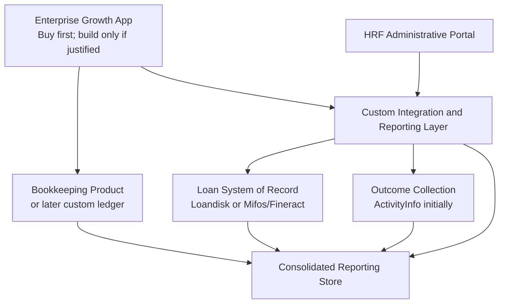

# Reinvest-to-Grow™ Enterprise Growth Platform Summary

## Project Goal

Build a mobile-first enterprise growth platform that helps Home Roots Foundation deliver Reinvest-to-Grow™ to entrepreneurs in resource-constrained settings.

The project has two connected goals:

1. Help entrepreneurs understand and improve enterprise performance, keep useful financial records, and reinvest productively without requiring formal bookkeeping or accounting knowledge.
2. Help Home Roots Foundation deliver the model consistently and demonstrate enterprise, financing, and program outcomes to grant funders.

The product should make daily enterprise tracking and support simple through a traditional mobile UI, speech input, document scanning, multilingual interaction, AI assistance, and plain-language reports.

This project will be built as a custom application. The decision is intentionally not only economic: the custom build supports a real nonprofit mission, creates a useful service for people who need it, and gives the developer a serious full-stack product to build while keeping skills sharp after a layoff.

## Product Requirements

## Enterprise Growth App

The entrepreneur-facing product should be simple enough for business owners who do not have bookkeeping training.

Core capabilities:

- Mobile-first user experience
- Traditional touch UI plus speech-operated workflows
- Multilingual input and output
- Receipt and document scanning
- Sales, expenses, cash movement, inventory, and profit tracking
- Plain-language confirmations instead of accounting terminology
- Offline or low-connectivity support
- AI assistance for organizing inputs, classifying transactions, extracting receipt data, and suggesting next steps
- Simple reports that explain business performance clearly

Example entrepreneur workflows:

- Record a cash sale
- Record an expense from speech
- Photograph a receipt and review the extracted transaction
- Correct an incorrect category
- Ask how much profit the business made this week
- See current loan balance and upcoming repayment
- Review recent transactions while offline

## HRF Administrative Portal

The nonprofit needs an administrative system for managing entrepreneurs, enterprises, financing, repayment status where applicable, documents, and outcomes.

Core capabilities:

- Manage businesses, owners, staff, and roles
- Track financing applications, disbursements, repayment schedules, partial payments, late payments, and balances where applicable
- View portfolio health across businesses
- Track repayment rates, delinquency, and portfolio-at-risk
- Store entrepreneur documents and notes
- Review business activity and financial reports
- Collect grant and impact metrics
- Export defensible reports for funders
- Maintain audit history for sensitive actions

## Reporting Requirements

Reports should be split into two major categories.

Business-owner reports:

- Revenue
- Expenses
- Profit
- Cash on hand
- Outstanding customer payments
- Inventory movement
- Loan balance
- Upcoming repayment
- Simple trends and plain-language explanations

Nonprofit and grant reports:

- Businesses funded
- Business survival rate
- Revenue and profit changes after funding
- Jobs created or retained
- Owner income changes
- Loan repayment rate
- Delinquency rate
- Portfolio-at-risk
- Capital deployed and recycled
- Cost to administer each loan
- Demographic and regional outcomes

Outcome metrics should be stored as dated observations with source and collection method. Grant reports need to be traceable to underlying records, not just AI-generated summaries.

## Main Architecture Decision

The main architecture direction is a custom AWS-native platform with a modular monolith backend, an Enterprise Growth App, the HRF Administrative Portal, and carefully controlled AI/document-processing workers.

Start with a modular monolith instead of microservices. The product workflows will change significantly during early development and field testing, and a modular monolith keeps deployment, testing, data consistency, and operations simpler.

## Proposed Starting Architecture


## Recommended Technology Stack

| Area | Recommendation |
|---|---|
| Mobile app | React Native, Expo, TypeScript |
| Mobile local storage | SQLite with offline synchronization |
| HRF Administrative Portal | React, TypeScript, Vite, Material UI |
| Backend | Java 21+, Spring Boot |
| AI/document workers | Python workers or Lambda handlers |
| Database | Amazon RDS PostgreSQL or Aurora PostgreSQL |
| Document storage | Amazon S3 |
| Authentication | Amazon Cognito initially |
| Async processing | SQS, EventBridge, Step Functions where useful |
| Hosting | ECS Fargate for backend; CloudFront/S3 or Amplify for web |
| Infrastructure as code | AWS CDK with TypeScript, or Terraform |
| CI/CD | GitHub Actions |
| Monitoring | CloudWatch plus Sentry for mobile/web |
| OCR | Amazon Textract |
| Speech-to-text | Amazon Transcribe |
| Text-to-speech | Amazon Polly |
| AI | Amazon Bedrock behind an internal provider interface |

## Backend Domain Modules

Keep these as separate modules inside the initial Spring Boot backend:

- Organizations and tenants
- Users, roles, and permissions
- Businesses and owner profiles
- Financial ledger
- Sales, expenses, inventory, and cash movements
- Financing products, disbursements, and repayments
- Documents and extraction jobs
- AI suggestions and approvals
- Outcome metrics
- Reports
- Audit history

## Financial System Design

The app should use simple language in the UI, but the underlying system should maintain reliable financial records.

Use double-entry accounting internally, while hiding debits, credits, and journals from business owners.

Example:

The user says:

```text
I bought ten bags of flour for 50 dollars cash.
```

The system proposes:

- A 50 dollar expense or inventory purchase
- A 50 dollar reduction in cash
- A suggested category
- An attached receipt or supporting document, if available

The user sees:

```text
Record a 50 dollar flour purchase paid with cash?
```

After confirmation, the backend creates the final ledger entries and immutable audit history.

## AI Architecture

Treat AI as an untrusted assistant, not the system of record.

AI can help with:

- Converting speech into proposed actions
- Classifying receipts and transactions
- Extracting fields from documents
- Translating user interactions
- Explaining reports in plain language
- Detecting duplicates or unusual transactions
- Suggesting follow-up questions

AI should not:

- Directly create finalized ledger entries
- Change loan balances
- Approve payments
- Produce grant metrics without traceable source data
- Execute arbitrary backend operations

The preferred workflow is:

```text
User input
  -> speech or OCR extraction
  -> structured AI proposal
  -> deterministic validation
  -> user confirmation
  -> ledger transaction
  -> immutable audit record
```

AI outputs should match versioned JSON schemas. Store the original input, extracted data, model/provider/version, confidence, user corrections, and final approved result.

## Offline-First Mobile Design

The mobile app should assume unreliable connectivity.

The Enterprise Growth App should allow users to:

- Record sales and expenses offline
- Photograph receipts offline
- Review recent transactions offline
- Queue uploads and synchronization
- Understand what is saved locally versus synced
- Resolve synchronization conflicts when needed

Offline behavior is not a later polish item. It is central to the target users and should shape the mobile data model early.

## Security Baseline

The platform will handle financial records, identity data, scanned documents, and nonprofit operating data. Security needs to be part of the first architecture, not a retrofit.

Minimum baseline:

- Separate AWS accounts for development, staging, and production
- TLS everywhere
- KMS encryption for databases, documents, queues, and backups
- MFA for staff and administrators
- Role-based access control
- Strict tenant isolation
- Immutable audit events for financial changes
- Malware scanning for uploaded files
- Presigned S3 upload and download URLs
- Automated backups and tested recovery
- Secrets Manager for credentials
- CloudTrail, GuardDuty, and security alerts
- Data retention and deletion policies
- No sensitive data in logs or AI prompts unless necessary

## Suggested Delivery Sequence

1. Build a narrow pilot around sales, expenses, receipt capture, and simple profit reporting.
2. Add offline mobile synchronization.
3. Add speech-based transaction entry for one or two target languages.
4. Add financing tracking and HRF Administrative Portal views.
5. Add defensible outcome metrics.
6. Add broader document types, languages, and AI automation after observing real usage.

The largest product risk is not the backend architecture. It is whether speech, terminology, reports, and confirmation flows make sense to real users across different languages, literacy levels, currencies, devices, and business practices.

## Recommended First MVP

The first MVP should be deliberately narrow:

- One nonprofit organization
- A small number of entrepreneur-led businesses
- One currency
- One or two languages
- Manual user provisioning
- Sales entry
- Expense entry
- Receipt photo upload
- Basic OCR extraction
- AI-assisted transaction proposal
- User confirmation before posting
- Simple profit report
- Basic financing balance and repayment schedule where applicable
- HRF Administrative Portal view of businesses and transactions

This creates enough real product surface to test the concept without trying to build a complete accounting, lending, and impact-management suite in the first pass.

## Appendix: Build-Vs-Buy Analysis

## Summary

The build-vs-buy analysis found that no single mature SaaS product satisfies the full product vision:

- Extremely simple entrepreneur bookkeeping
- Voice-operated and multilingual interaction
- Receipt and document scanning
- Offline use in low-connectivity environments
- Nonprofit financing administration
- Entrepreneur and enterprise performance reporting
- Grant and impact reporting
- Unified HRF administrative workflows

Existing products cover portions of the requirement, especially loan management, receipt capture, accounting, and outcome reporting. The alternative path would be a hybrid buy-and-build approach.

## Hybrid Alternative

The hybrid option would use:

- A loan-management product as the system of record
- An outcome/reporting product for grant metrics
- A bookkeeping product during discovery
- A custom integration and reporting layer
- A custom Enterprise Growth App only if existing bookkeeping tools fail in field testing

This is lower risk operationally, but it gives less control over the entrepreneur experience, offline behavior, language support, data model, and long-term product direction.

## Candidate Products

Voice-first and simple bookkeeping:

- Talkbooks
- OMNIFince
- Kweezi
- MarathonBooks

General bookkeeping and receipt capture:

- SparkReceipt
- Finovo
- Zoho Books
- Odoo
- Wave
- QuickBooks Online

Loan and microfinance platforms:

- Loandisk
- Bryt
- Cladfy Microlender
- Oradian Instafin
- Mifos X / Apache Fineract

Outcome and grant reporting:

- ActivityInfo
- Salesforce Nonprofit Cloud
- Submittable

## Most Relevant Alternatives

Loandisk is the fastest SaaS candidate for loan management. It provides loan products, schedules, repayments, borrower files, staff roles, portfolio reports, arrears reporting, and lender accounting.

Mifos X / Apache Fineract is the leading open-source alternative for a configurable loan-management core. It offers stronger ownership and extensibility but adds meaningful implementation and operational responsibility.

Talkbooks is the closest identified product to the desired voice-first bookkeeping experience. It may be especially relevant if the first target market aligns with its current regional focus.

SparkReceipt, Finovo, and Zoho Books are useful bookkeeping and receipt-capture comparison points, but they may not satisfy the desired voice-first, offline, low-literacy entrepreneur experience.

ActivityInfo is a strong initial candidate for offline-capable outcome collection and program reporting.

## Alternative Target Architecture



The custom integration layer would own:

- Cross-system business and entrepreneur identifiers
- Authentication and authorization integration
- Data synchronization and audit logs
- Consolidated portfolio and outcome reporting
- Data-quality checks
- Vendor-independent exports

## Why Custom Build Remains The Main Path

The hybrid path is sensible if the primary goal is minimizing operational risk and reaching a pilot quickly. For this project, the custom build is also valuable because:

- The entrepreneur experience is the most mission-specific part of the product.
- Offline, speech-first, multilingual bookkeeping may require deep UX control.
- A unified product can avoid forcing entrepreneurs and nonprofit staff across fragmented systems.
- The work creates a serious, modern engineering project across mobile, backend, cloud, AI, security, and reporting.
- The nonprofit mission makes the effort worthwhile even before there is a commercial justification.

The build-vs-buy analysis should still influence implementation. The custom app should avoid unnecessary reinvention where existing services can be integrated safely, and the loan/accounting domains should be built carefully because correctness matters.
