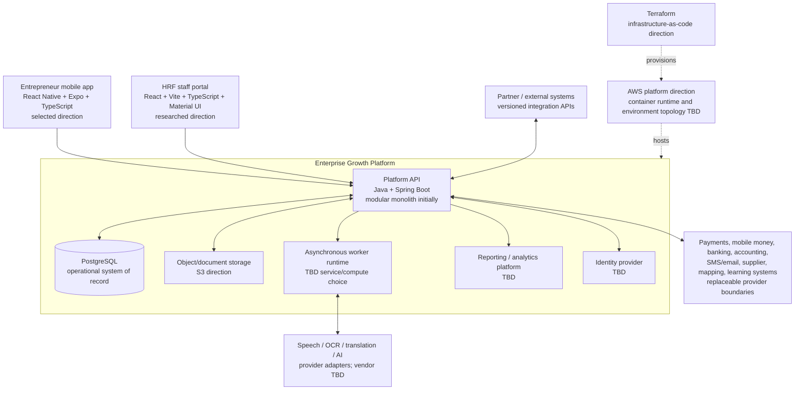
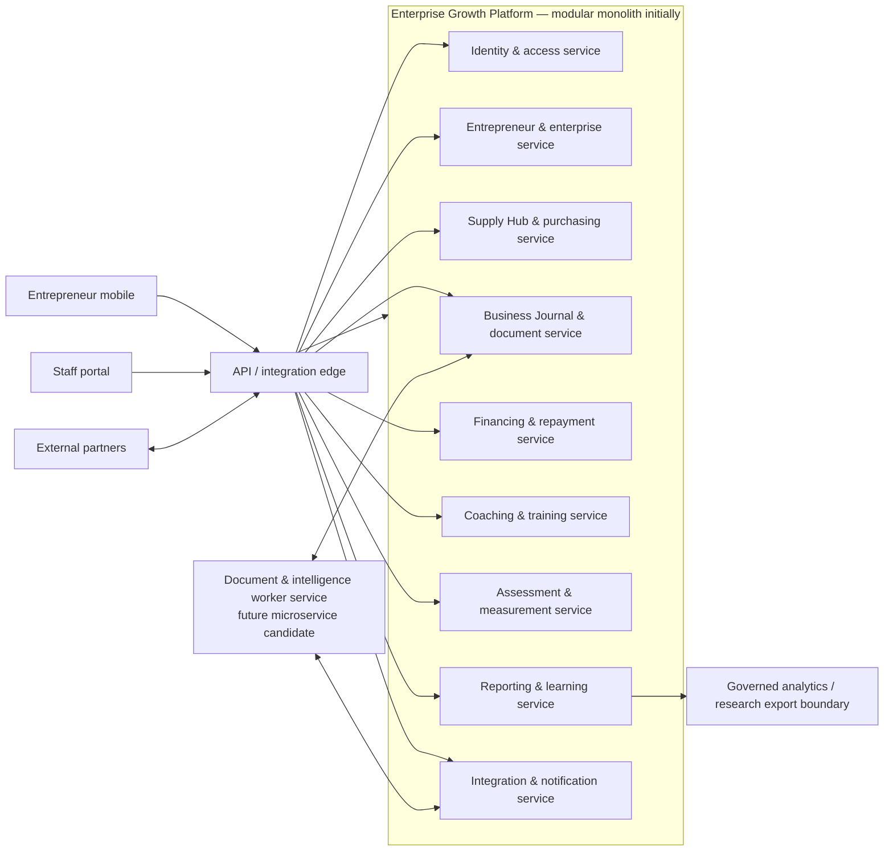
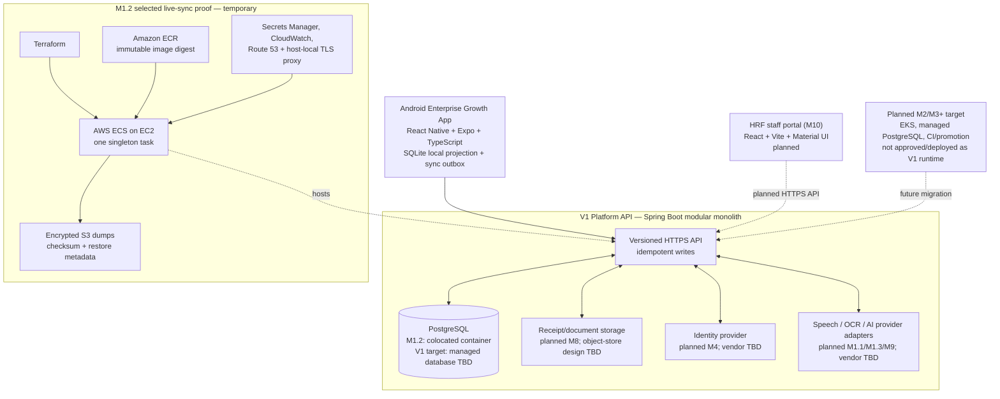
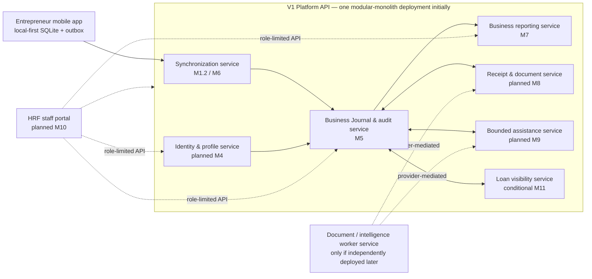

# High-level systems architecture

Prepared: 2026-09-18
Purpose: source material for two system-architecture diagram types:

1. **Technology and tools view** — the runtime topology: clients, frameworks, major cloud/data services, workers, and external-provider boundaries.
2. **Service-boundary view** — the functional decomposition into logical services. A service is the smallest element shown; individual features, endpoints, tables, and jobs do not appear.

## Diagram conventions

- **Selected / accepted direction** means the technology or boundary has a current supporting decision.
- **Planned** means the roadmap has a direction but a future slice must still approve and implement it.
- **TBD** means the diagram deliberately identifies a gap; it is not a placeholder decision.
- A box inside **“modular monolith, initially”** is a logical service boundary, not a separately deployed microservice. It becomes a microservice only after an explicit reason and approved change justify independent deployment.
- AI, OCR, speech, translation, and external finance/notification systems stay behind provider/integration boundaries. Their output cannot bypass proposal, validation, and human confirmation for consequential records.

---

## Full vision — technology and tools view

This is the long-term directional topology. It communicates the technology families already selected or researched and exposes undecided technology slots. It does not imply that every planned tool exists today.

**Rendering note:** arrange clients across the top, the Platform API at the visual center, primary stores beneath it, worker/provider services to one side, and reporting/analytics below. Use a distinct dashed or muted treatment for every `TBD` and planned box.

## Full vision — service-boundary view

The JLP vision calls for these service-sized domains. The source material does **not** authorize deployment as microservices; the default is modules in the Platform API until a service has a strong independent-scale, security, ownership, or release need.

The enterprise context connects the services conceptually; it does not authorize a shared-database free-for-all. The detailed design must define ownership, interfaces, and consistency rules before any service split.

---

## V1 — technology and tools view

This diagram combines the **selected M1.2 proof** with the **planned V1 direction** without presenting them as the same environment.

The V1 diagram should use solid styling for the mobile, SQLite, Spring Boot, versioned/idempotent API, PostgreSQL direction, and M1.2 proof. It should use dashed styling for the staff portal, receipts, identity, AI providers, and M2/M3 target components that remain unimplemented or undecided.

## V1 — service-boundary view

The V1 logical services below are initially modules in one deployable Spring Boot service. The boxes describe the largest acceptable functional boundaries, not individual workflows such as “record sale” or “receipt parse.”

The active M1.2 proof contains only the synchronization path and a minimal transaction store. It does not deliver the staff portal, full identity, document storage, receipt processing, AI assistance, reports, or loan visibility.

## Diagram handoff checklist

- Produce four separate panels: full-vision tools, full-vision services, V1 tools, V1 services.
- Put the legend on every exported diagram: selected, planned, and TBD.
- Do not name AWS Transcribe, Polly, Textract, Bedrock, SQS, EventBridge, Cognito, EKS, or RDS as a committed end-state choice unless a new decision approves it. The prior image may be used as a layout reference, not as authority for those selections.
- Do not draw a service box below the microservice/module level. Screens, endpoints, tables, queues, and individual automations belong in the later detailed design.
